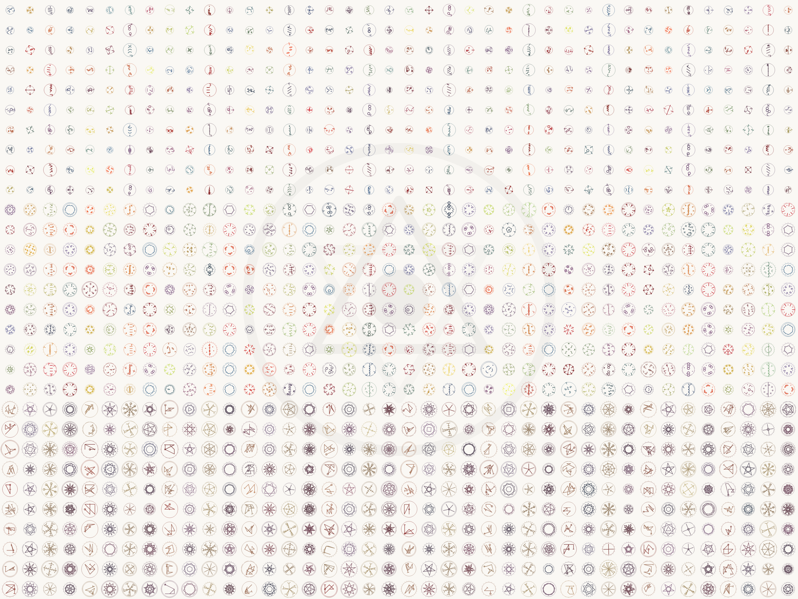

# Gallery — 1,200 pieces

<p align="center">
  
</p>

**Every piece above was produced by the engine.** Nothing was drawn by hand, corrected by hand, or
selected for the picture. This is what the output looks like at scale.

The image is one grid of **1,200 pieces**, 40 columns by 30 rows, and it reads as three bands
because it *is* three sets — the engine has three composition modes, and each produced 400.

| Band | Mode | What it does |
|---|---|---|
| **top third** | sparse | one axial stroke, accents around it. Open, legible at small sizes |
| **middle third** | dense | crowns, rosettes, nested rings. The heaviest of the three |
| **bottom third** | continuous line | one unbroken path — stars, seals, inscribed polygons |

Closer looks, 25 pieces each:

| | | |
|---|---|---|
| [sparse](samples/gallery/detail-A.png) | [dense](samples/gallery/detail-B.png) | [continuous line](samples/gallery/detail-C.png) |

---

## The open set — 100 pieces you can actually take

[`samples/open-set/`](samples/open-set/) holds **100 SVG files**, roughly a third from each mode.

**They are not taken from the 1,200 above.** They were generated fresh, from a seed that belongs
to no existing set, and verified by hash against all 2,400 files of the three packs: **zero
collisions.** The wall shows what exists; the open set shows that the engine keeps going.

Each open-set file carries its provenance **in more than one form**. The visible ones:

- `<metadata>` naming the authors, the origin and the license;
- a **fingerprint** — 16 hex characters, unique per piece, derived from its own content;
- the engine's **signature mark**, drawn behind the artwork at very low opacity.

Provenance is not limited to what is listed here, and stripping the visible parts does not make a
file anonymous.

---

## What the signature protects, and what it does not

Said plainly, because the opposite claim is easy to make and easy to disprove.

**It is not copy protection, and there is no anti-tamper mechanism here.** These are static files:
an SVG is text, a PNG is pixels. Neither executes anything, so nothing can detect being copied and
nothing can react to it. Any page claiming otherwise about static files is wrong.

What is actually true:

| | |
|---|---|
| **The wall is raster, on purpose** | A contact sheet in SVG is a container of the full vectors of every piece on it — we verified that the five paths of a packaged piece sit unchanged inside its sheet. The wall is a PNG so that looking at 1,200 pieces is not the same as receiving 1,200 pieces |
| **Auto-tracing a PNG gives an approximation** | Not the piece. The curve data is gone |
| **Provenance survives ordinary handling** | Recolouring a piece, renaming it, or deleting the blocks listed above does not detach it from its origin |
| **None of that is a lock** | Everything here can be defeated by someone determined enough. The point is not to make copying impossible — it is to make *this piece came from here* demonstrable afterwards |

**The real protection is the license, not the format.** See [`LICENSE`](LICENSE): the open set is
published for evaluation and personal study. Redistribution, use as training data for machine
learning models, and authorship claims are not permitted — in any of the three cases, regardless
of any other permission.

---

## How to check any of this yourself

```sh
# fingerprint of a piece
grep -o '<fingerprint>[0-9a-f]*' samples/open-set/OPEN-A-001.svg

# every fingerprint is distinct
grep -ho '<fingerprint>[0-9a-f]*' samples/open-set/*.svg | sort -u | wc -l   # → 100

# the signature mark is present and behind the artwork
grep -o 'class="sig"' samples/open-set/OPEN-A-001.svg
```
